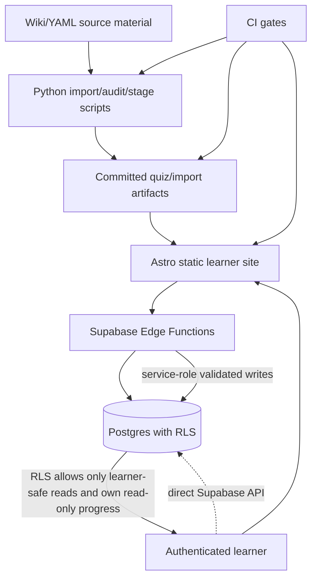

# Refactor Security and Workflow Hardening

## Summary

Harden the Salem Study System around the audit findings while preserving the intentional hidden-link account creation model. The plan prioritizes database-enforced learner boundaries, generated-data/CI guardrails, frontend XSS/token-risk reduction, and contract cleanup without changing the learner-facing study model.

---

## Problem Frame

The app builds and the current test suites pass, but several important guarantees currently depend on frontend behavior or convention rather than enforceable backend/data policies. The most important work is to make redaction, quiz eligibility, progress integrity, and workflow reproducibility durable enough for wider beta use.

---

## Requirements

- R1. Preserve the intentional private beta account model: the public site shows login/contact only, while a private hidden signup link can be shared without creating per-user invite codes.
- R2. Prevent learner accounts from directly reading redacted, ineligible, or non-public quiz/source content through Supabase APIs.
- R3. Prevent learner accounts from directly spoofing quiz sessions, attempts, scores, or review state through Supabase APIs.
- R4. Ensure quiz-result submission accepts only active, quiz-eligible, non-redacted questions and maintains server-side scoring as the source of truth.
- R5. Add reproducible Python and frontend quality gates so local development and CI run the same meaningful checks.
- R6. Add a generated-data drift guard so committed quiz/import artifacts cannot fall behind source wiki/YAML data.
- R7. Reduce frontend XSS and browser-token exposure in quiz/wiki editing flows.
- R8. Normalize backend/frontend contracts for quiz types, Edge Function responses, shared auth/CORS helpers, and response typing.
- R9. Improve build/test workflow efficiency without weakening deployment verification.
- R10. Update durable documentation, especially README authentication wording, so project behavior and implementation match.

---

## Scope Boundaries

- Do not remove the hidden shareable account creation route or require per-user invite codes for normal private beta signup.
- Do not create AI-generated questions or alter source-traceability requirements for plant facts.
- Do not change the public learner route model (`/study/`, `/quiz/`, `/graph-v2/`, `/history/`) except where needed for security or performance hardening.
- Do not deploy Supabase migrations/functions without explicit deploy authorization and credentials loaded safely.
- Do not hand-edit generated quiz data except as part of a verified source-to-generated regeneration workflow.

### Deferred to Follow-Up Work

- Full lazy-loading/per-question content chunking for all large quiz pages can be split after security and CI gates land if the initial performance pass becomes too large.
- Strong CSP can follow after inline scripts and raw HTML sinks are reduced enough to make a practical policy maintainable.

---

## Context & Research

### Relevant Code and Patterns

- `CLAUDE.md` defines the project quality bar: source traceability, no fabricated plant facts, and careful verification.
- `README.md` documents the app architecture, private beta model, build/test commands, generated-data workflow, and deployment boundaries.
- `supabase/functions/_shared/http.ts` already contains the preferred shared helper pattern for CORS, JSON responses, method checks, admin client creation, bearer parsing, and `requireUser`.
- `supabase/functions/submit-question-review/index.ts` is the best current example of an Edge Function using shared helpers and filtering questions by learner-safe eligibility.
- `supabase/migrations/20260429_quiz_mvp_schema.sql` contains the current RLS policies and quiz/progress table contracts that need tightening.
- `site/src/utils/auth-client.ts` is the frontend contract hub for Edge Function calls and Supabase session access.
- `scripts/exam_question_import.py`, `scripts/build_static_quiz_bank.py`, `scripts/build_structured_quiz_bank.py`, and `scripts/validate_structured_quiz_bank.py` define the source-to-generated quiz-data pipeline.
- `.github/workflows/deploy.yml` is the current release gate for Python checks, Node tests, UI smoke, and Astro/Pagefind build.

### Institutional Learnings

- The project already treats generated artifacts as derived from wiki/YAML/PDF/source material. Any hardening should preserve that source-of-truth boundary.
- Public/source PDFs intentionally remain on the site and are not an optimization target.
- Browser code should only use public Supabase config plus learner JWTs; service-role access belongs in Edge Functions after JWT validation.

### External References

- Supabase Row Level Security and Edge Function best practices should be checked during implementation for policy syntax, `security definer` helpers, and service-role isolation details.
- Astro guidance for safe inline JSON / script data should be checked before finalizing the serializer approach.

---

## Key Technical Decisions

- Treat database RLS as the primary content/progress boundary, not the frontend. Edge Functions remain the preferred write path, but RLS must also block direct API misuse.
- Preserve hidden-link signup and document it clearly. The signup hardening work is limited to README accuracy and optional invite-code race cleanup for compatibility, not adding required per-user codes.
- Prefer shared Edge Function helpers over per-function duplication so auth, CORS, error shape, and method handling do not drift.
- Add CI gates before large refactors where possible. A stronger safety net should land early so subsequent hardening work has fast feedback.
- Favor structured rendering/safe serialization over expanding ad hoc HTML escaping inside page scripts.

---

## Open Questions

### Resolved During Planning

- Should code-free hidden signup be treated as a bug? No. It is intentional; README should be updated to state that private account creation uses a direct shareable hidden route and invite codes are compatibility, not default UX.

### Deferred to Implementation

- Exact RLS policy/view shape: implementation should choose between filtered base-table policies and learner-safe views after checking Supabase policy ergonomics and tests.
- Exact frontend sanitizer/renderer shape: implementation should inspect current rich content needs and choose either structured blocks, strict sanitization, or both.
- Whether the large-page performance work is one implementation unit or split into a follow-up PR depends on diff size after the initial security/CI work lands.

---

## High-Level Technical Design

> *This illustrates the intended approach and is directional guidance for review, not implementation specification. The implementing agent should treat it as context, not code to reproduce.*

The target shape is: direct learner API access is safe even when attempted outside the UI; Edge Functions perform validated writes; CI proves generated artifacts, types, tests, and build outputs are consistent before deploy.

---

## Implementation Units

### U1. Document the intentional hidden-link signup model

**Goal:** Make README and related docs match the intended private beta signup behavior.

**Requirements:** R1, R10

**Dependencies:** None

**Files:**
- Modify: `README.md`
- Modify if needed: `docs/backend-deploy.md`
- Test: none

**Approach:**
- Update the Authentication and beta account model section to say the public site exposes login/contact only, while account creation is through a private direct-link route that can be shared without per-user invite codes.
- Clarify that invite-code compatibility may remain, but it is not the default access-control mechanism.
- Keep the route described as private/direct-link/noindex, not as public self-serve signup.

**Patterns to follow:**
- Existing README authentication section around private create-account slug and invite-code compatibility.

**Test scenarios:**
- Test expectation: none -- documentation-only change.

**Verification:**
- README no longer implies missing invite code is an implementation defect.
- Documentation still states no public signup link appears on normal public navigation.

---

### U2. Tighten learner read RLS for quiz/source content

**Goal:** Ensure authenticated learners can only read learner-safe quiz/source content through direct Supabase APIs.

**Requirements:** R2

**Dependencies:** U1 for documentation clarity, but can be implemented independently.

**Files:**
- Create: `supabase/migrations/<date>_harden_quiz_content_rls.sql`
- Modify: `supabase/migrations/20260429_quiz_mvp_schema.sql` only if maintaining historical/bootstrap schema is part of project convention; otherwise leave historical migrations immutable.
- Test: `tests/test_invite_auth_artifacts.py` or new `tests/test_supabase_rls_artifacts.py`
- Test: SQL verification snippets in `docs/backend-deploy.md` if migration deploy needs manual validation.

**Approach:**
- Replace learner `using (true)` read policies for `questions`, `choices`, `question_references`, and `sources` with filters that expose only public/active/eligible/non-redacted content to learner roles.
- Preserve reviewer/admin content-management access through role checks.
- Ensure child tables such as `choices` and `question_references` are readable only when their parent question is learner-readable.
- Consider learner-safe views if base-table RLS becomes too complex or risks policy recursion.

**Execution note:** Add characterization tests/assertions for the generated SQL policy text before changing policy shape.

**Patterns to follow:**
- Existing `public.current_role()` helper in `supabase/migrations/20260429_quiz_mvp_schema.sql`.
- Existing question eligibility filters in `supabase/functions/submit-question-review/index.ts`.

**Test scenarios:**
- Happy path: learner can read active, quiz-eligible, non-redacted question rows and corresponding choices/references.
- Error path: learner cannot read redacted questions or their choices/references.
- Error path: learner cannot read ineligible, draft, outdated, retired, or conflict content through direct table reads.
- Integration: reviewer/admin role retains management access to content tables.

**Verification:**
- SQL migration is idempotent where practical.
- Tests or static SQL assertions cover policy names and learner-safe predicates.
- Backend deploy notes include safe SQL checks to validate redacted rows are hidden from learner context.

---

### U3. Restrict direct learner writes to quiz/progress state

**Goal:** Prevent learners from spoofing quiz sessions, attempts, scores, and review state through direct Supabase API writes.

**Requirements:** R3, R4

**Dependencies:** U2 recommended first so content visibility and progress writes harden together.

**Files:**
- Create: `supabase/migrations/<date>_harden_quiz_progress_rls.sql`
- Modify: `supabase/functions/submit-quiz-results/index.ts`
- Modify: `supabase/functions/submit-question-review/index.ts` only if response or state-write behavior needs alignment.
- Test: `tests/test_invite_auth_artifacts.py` or new `tests/test_supabase_rls_artifacts.py`
- Test: `site/tests/quiz-v2-progress.node.test.ts` if frontend expectations change.

**Approach:**
- Change learner policies on `quiz_sessions`, `quiz_session_questions`, `question_attempts`, and `user_question_state` so direct learner access is read-only where needed; writes should go through service-role Edge Functions.
- Add constraints or triggers to prevent `selected_choice_id` from mismatching `question_id` and to prevent client-supplied correctness from becoming authoritative if direct insertion ever reappears.
- Keep Edge Function write paths working with service-role access after JWT validation.

**Execution note:** Start with tests/static assertions proving the current migration allows the too-broad direct write policies, then update expectations with the hardened policy.

**Patterns to follow:**
- Server-side scoring in `supabase/functions/submit-quiz-results/index.ts`.
- Whole-question review state update path in `supabase/functions/submit-question-review/index.ts`.

**Test scenarios:**
- Happy path: `submit-quiz-results` can still persist completed attempts through service-role after authenticating the learner.
- Happy path: `submit-question-review` can still upsert review state through service-role after authenticating the learner.
- Error path: direct learner insert/update into attempts/state is rejected by RLS or impossible through policy.
- Error path: mismatched selected choice/question cannot be persisted.
- Integration: history/review reads still return the learner's own progress after service-role writes.

**Verification:**
- Existing Node progress/review tests pass.
- Python artifact tests assert hardened policies are present.
- Manual backend deploy checklist includes safe post-migration probes without exposing credentials.

---

### U4. Harden `submit-quiz-results` eligibility and contract behavior

**Goal:** Ensure result submission only accepts safe eligible questions and does not silently coerce unsupported quiz types.

**Requirements:** R4, R8

**Dependencies:** U2 for the same learner-safe content predicate.

**Files:**
- Modify: `supabase/functions/submit-quiz-results/index.ts`
- Modify: `site/src/utils/auth-client.ts`
- Modify: `supabase/migrations/20260429_quiz_mvp_schema.sql` or a new migration for quiz type check constraint updates.
- Test: `tests/test_invite_auth_artifacts.py`
- Test: `site/tests/quiz-v2-backend-session.node.test.ts` or new Node contract tests if frontend payload types change.

**Approach:**
- Add `status = active`, `quiz_eligible = true`, and `is_redacted = false` filters to submitted question lookup.
- Decide the canonical quiz type set, then align SQL check constraints, backend normalizer, and frontend `SubmitQuizResultsPayload` type.
- Prefer returning `invalid_quiz_type` for unsupported values rather than silently storing `custom`.
- Preserve server-side source-label resolution and correctness computation.

**Patterns to follow:**
- `submit-question-review` eligibility lookup.
- Existing frontend auth-client function typing.

**Test scenarios:**
- Happy path: classic quiz payload with eligible active questions persists and returns attempts/score.
- Error path: redacted, draft, outdated, or ineligible slug returns a clear error and persists no attempts.
- Error path: unsupported quiz type returns a clear validation error instead of becoming `custom`.
- Integration: frontend payload types match backend accepted values and SQL constraint values.

**Verification:**
- Node quiz result tests and Python auth artifact tests pass.
- SQL constraint and frontend/backend enum values are visibly aligned.

---

### U5. Standardize Edge Function helpers and response contracts

**Goal:** Reduce CORS/auth/error drift across Supabase Edge Functions.

**Requirements:** R8

**Dependencies:** U4 can be implemented before or alongside this unit; avoid mixing broad helper migration with RLS changes in one diff if review size grows.

**Files:**
- Modify: `supabase/functions/_shared/http.ts`
- Modify: `supabase/functions/username-login/index.ts`
- Modify: `supabase/functions/invite-signup/index.ts`
- Modify: `supabase/functions/contact-feedback/index.ts`
- Modify: `supabase/functions/create-quiz-v2-session/index.ts`
- Modify: `supabase/functions/submit-quiz-results/index.ts`
- Modify: `supabase/functions/quiz-history/index.ts`
- Modify: `supabase/functions/quiz-review-queue/index.ts`
- Modify: `supabase/functions/submit-question-review/index.ts`
- Modify: `site/src/utils/auth-client.ts`
- Test: `tests/test_invite_auth_artifacts.py`
- Test: relevant `site/tests/*.node.test.ts` contract tests.

**Approach:**
- Extend `_shared/http.ts` to cover the common patterns currently duplicated: CORS, JSON response, method check, admin client creation, bearer token extraction, and user auth.
- Decide whether to standardize response shape now or in a small follow-up inside this unit. If response shape changes, update frontend types at the same time.
- Preserve contact-feedback's intentional public/optional-auth behavior, but make invalid non-anon bearer behavior explicit.
- Keep service-role clients configured with non-persistent auth sessions.

**Patterns to follow:**
- Current `submit-question-review` use of shared helpers.
- Existing frontend `postFunction` centralization in `site/src/utils/auth-client.ts`.

**Test scenarios:**
- Happy path: auth-required function accepts a valid learner JWT and returns expected data.
- Error path: missing bearer returns `missing_authorization` consistently for auth-required functions.
- Error path: invalid bearer returns `invalid_authorization` consistently for auth-required functions.
- Error path: method other than POST returns `method_not_allowed` consistently.
- Integration: contact feedback still accepts intended public submissions and does not expose reply emails in downstream issue text.

**Verification:**
- Existing auth/progress/contact tests pass.
- Shared helper usage reduces duplicated per-function CORS/auth boilerplate.

---

### U6. Add reproducible Python dependencies and full Python CI coverage

**Goal:** Make local and CI Python test behavior reproducible and complete.

**Requirements:** R5

**Dependencies:** None; this should land early.

**Files:**
- Create: `requirements-dev.txt` or `pyproject.toml`
- Modify: `.github/workflows/deploy.yml`
- Modify: `README.md`
- Test: existing `tests/*.py`

**Approach:**
- Add an explicit Python dependency manifest that includes PyYAML with an appropriate version constraint.
- Update CI to install Python dependencies from that manifest.
- Replace the current three-module Python release check with full test discovery.
- Document the Python setup command in README.

**Patterns to follow:**
- Existing README Build and test commands section.
- Current CI Python setup block in `.github/workflows/deploy.yml`.

**Test scenarios:**
- Happy path: clean environment can install Python dependencies from the manifest and run full test discovery.
- Error path: missing PyYAML is no longer possible after documented setup.
- Integration: CI runs tests covering import, Supabase sync, auth artifacts, wiki index, and content checks.

**Verification:**
- Full Python discovery passes locally and in CI.
- CI no longer installs unpinned ad hoc Python dependencies.

---

### U7. Add frontend typecheck/lint gate

**Goal:** Add a minimum useful frontend static check before larger frontend hardening work.

**Requirements:** R5

**Dependencies:** None; should land early with U6 if possible.

**Files:**
- Modify: `site/package.json`
- Modify: `site/package-lock.json`
- Modify: `.github/workflows/deploy.yml`
- Modify: `README.md`
- Test: existing `site/tests/*.node.test.ts` and UI tests as needed.

**Approach:**
- Install and configure `typescript` and `@astrojs/check`.
- Add `npm run check` or `npm run typecheck` using `astro check`.
- Add the check to CI before build/UI smoke.
- Defer broader ESLint/formatter adoption if it creates too much unrelated churn; note it as follow-up if not included.

**Patterns to follow:**
- Existing strict `site/tsconfig.json`.
- Existing package script style in `site/package.json`.

**Test scenarios:**
- Happy path: `npm run check` passes on the current site.
- Error path: a representative Astro/TS type error would fail the check.
- Integration: CI runs the check before deploy build.

**Verification:**
- `npm run check`, `npm run test:node`, and `npm run build` pass.

---

### U8. Add generated-data drift guard

**Goal:** Ensure committed generated quiz/import artifacts stay synchronized with canonical source files.

**Requirements:** R6

**Dependencies:** U6 recommended so CI has reproducible Python dependencies.

**Files:**
- Modify: `.github/workflows/deploy.yml`
- Modify: `scripts/build_structured_quiz_bank.py`
- Modify if needed: `scripts/build_static_quiz_bank.py`
- Modify: `README.md`
- Test: `tests/test_structured_quiz_bank_builder.py`
- Test: `tests/test_quiz_bank_builder.py`

**Approach:**
- Normalize `generatedFrom` metadata so temp-dir generation does not create path-only drift.
- Add a CI regeneration step that rebuilds audit/staging/static/structured artifacts and fails if `git diff --exit-code` detects changes.
- Run `scripts/validate_structured_quiz_bank.py` after regeneration.
- Keep source-to-generated commands documented in README.

**Execution note:** Add builder tests for path normalization before changing CI so false positives are eliminated first.

**Patterns to follow:**
- `scripts/build_static_quiz_bank.py` already partially normalizes repo-relative provenance.
- `docs/structured-question-bank-v2.md` documents the structured bank validator.

**Test scenarios:**
- Happy path: regenerating from repo-relative inputs produces no diff on clean source.
- Edge case: regenerating through a temp path does not alter canonical `generatedFrom` metadata unexpectedly.
- Error path: intentionally stale generated data causes CI drift check to fail.
- Integration: validator runs against regenerated structured bank and catches missing image/block/schema issues.

**Verification:**
- Clean checkout passes regeneration/diff guard.
- Builder tests prove provenance normalization.

---

### U9. Reduce frontend XSS surfaces and token exposure

**Goal:** Remove the highest-risk browser-side injection and token-storage patterns.

**Requirements:** R7

**Dependencies:** U7 recommended first so typecheck protects refactors.

**Files:**
- Modify: `site/src/pages/quiz.astro`
- Modify: `site/src/pages/quiz-v2.astro`
- Modify: `site/src/pages/quiz-v2/play.astro`
- Modify: `site/src/pages/quiz-v2/review.astro`
- Modify: `site/src/pages/graph-v2.astro`
- Modify: `site/src/scripts/highlighter.ts`
- Create or modify: `site/src/utils/safe-json.ts` or equivalent shared helper
- Create or modify: `site/src/utils/render-blocks.ts` or equivalent structured rendering helper if needed
- Test: `site/tests/quiz-test.ts`
- Test: `site/tests/quiz-v2-test.ts`
- Test: `site/tests/quiz-v2-play-test.ts`
- Test: `site/tests/quiz-v2-review-test.ts`
- Test: `site/tests/graph-v2-test.ts`
- Test: new Node tests for safe serializer / block renderer if helper is pure TS.

**Approach:**
- Introduce a safe inline JSON serializer or convert large inline JSON payloads to fetched static JSON endpoints.
- Replace direct `innerHTML` where content is plain text with `textContent`/DOM node construction.
- For rich quiz explanations, prefer structured block rendering from `quiz-bank-v2` or strict sanitization from a controlled allowlist.
- Stop persisting GitHub tokens in `localStorage`. Prefer session-only memory or a backend-mediated edit path. If backend mediation is too large, make the first pass remove persistence and document token scope limits.
- Remove production console logging of selected content in highlighter flow.

**Patterns to follow:**
- Existing structured question block types in `site/src/types/question-blocks.ts`.
- Existing `QuestionBlockRenderer.astro` for server-rendered structured blocks.

**Test scenarios:**
- Happy path: quiz and review pages still render stems, choices, images, tables/lists/code blocks, and explanations correctly.
- Edge case: question/explanation text containing `</script>` is serialized safely and does not break the page.
- Error path: malformed or missing JSON data shows a controlled empty/error state rather than executing content.
- Error path: highlighter edit mode does not persist a GitHub token across browser sessions.
- Integration: Playwright smoke covers quiz, quiz-v2 play/review, and graph-v2 after rendering changes.

**Verification:**
- `npm run check`, `npm run test:node`, relevant Playwright smoke tests, and `npm run build` pass.
- Manual inspection confirms no high-risk `set:html={JSON.stringify(...)}` pattern remains without safe serialization.

---

### U10. Align frontend/backend API contracts

**Goal:** Make TypeScript payload/response types match Edge Function behavior and SQL constraints.

**Requirements:** R8

**Dependencies:** U4 and U5 should establish canonical backend behavior first.

**Files:**
- Modify: `site/src/utils/auth-client.ts`
- Modify: `supabase/functions/*/index.ts` where response shape changes
- Modify: `site/tests/*.node.test.ts` as applicable
- Test: `tests/test_invite_auth_artifacts.py`

**Approach:**
- Define canonical response shapes for Edge Functions and reflect them in frontend types.
- Make `signupWithInvite` return the backend success data rather than `void` if the UI or tests need the learner code.
- Include FSRS fields in `SubmitQuestionReviewResponse` if the backend returns them and the frontend can use or ignore them intentionally.
- Improve `postFunction` error extraction so structured error details are not lost.

**Patterns to follow:**
- Existing centralized `postFunction` in `auth-client.ts`.
- Existing Node tests around quiz-v2 backend sessions and review/progress helpers.

**Test scenarios:**
- Happy path: each frontend auth-client function parses the expected success shape.
- Error path: structured backend errors produce stable frontend error codes/messages.
- Integration: quiz/history/review UI behavior does not regress when response types become stricter.

**Verification:**
- Typecheck catches mismatched response use.
- Node tests cover representative success/error contract cases.

---

### U11. Optimize build/test workflow and large-page payloads

**Goal:** Reduce avoidable CI/build work and start reducing initial page payload size.

**Requirements:** R9

**Dependencies:** U7 recommended; U9 may overlap with payload splitting.

**Files:**
- Modify: `site/package.json`
- Modify: `.github/workflows/deploy.yml`
- Modify: `site/src/pages/quiz*.astro` and `site/src/pages/graph-v2.astro` if payload splitting is included in this unit.
- Test: existing Playwright smoke tests.

**Approach:**
- Split build scripts into `build:astro`, `build:search`, and full `build` so tests can choose whether Pagefind indexing is required.
- Avoid building twice in CI with different Supabase environment values unless explicitly needed.
- Use the locally installed `pagefind` binary instead of `npx pagefind`.
- If included in this pass, move graph/quiz detail data behind JSON endpoints or lazy rendering so initial HTML no longer embeds all detail content.

**Patterns to follow:**
- Existing `site/src/pages/data/graph-v2-detail-data.json.ts` JSON endpoint pattern.
- Current Playwright `webServer` behavior, if configured, should drive how built artifacts are reused.

**Test scenarios:**
- Happy path: CI can build once with deploy-intended env and run smoke against that artifact.
- Happy path: Pagefind index is still present in production build output.
- Edge case: local UI smoke can still run from a clean checkout without requiring a pre-existing `dist` unless documented.
- Integration: route smoke tests pass after script changes.

**Verification:**
- `npm run build`, UI smoke, and CI workflow pass.
- Build logs show redundant Pagefind/Astro work removed or justified.

---

### U12. Optional invite-code compatibility race cleanup

**Goal:** If invite-code compatibility remains, ensure it cannot over-claim under concurrency.

**Requirements:** R1, R8

**Dependencies:** U1 should clarify that invite codes are compatibility, not required default signup.

**Files:**
- Modify: `supabase/functions/invite-signup/index.ts`
- Create: optional migration/RPC if atomic DB claim is chosen
- Test: `tests/test_invite_auth_artifacts.py`

**Approach:**
- Keep code-free hidden-link signup working by design.
- For requests that do supply an invite code, make the invite claim atomic or verify affected-row count before leaving the created user/profile in place.
- Prefer a Postgres RPC if Supabase client update row-count behavior is awkward.

**Patterns to follow:**
- Existing rollback cleanup path in `invite-signup` when profile creation fails.

**Test scenarios:**
- Happy path: signup with no invite code still succeeds through hidden route behavior.
- Happy path: valid invite code increments `uses_count` once.
- Error path: stale/overused invite claim does not leave an orphan created user/profile.
- Integration: username login still works for users created with and without invite codes.

**Verification:**
- Auth artifact tests cover both code-free and invite-code signup modes.

---

## System-Wide Impact

- **Interaction graph:** RLS, Edge Functions, frontend auth-client types, and CI all interact; hardening should be delivered in dependency order to keep failures attributable.
- **Error propagation:** Edge Functions should return stable validation/auth/error codes that frontend code can display or log without exposing secrets.
- **State lifecycle risks:** Quiz/progress writes must avoid partial session/attempt/state writes; invite-code compatibility must avoid orphan auth users on failed claims.
- **API surface parity:** SQL constraints, Edge Function normalizers, frontend TypeScript types, and tests must agree on quiz types and response shapes.
- **Integration coverage:** Unit tests alone will not prove RLS behavior; include SQL artifact assertions and deploy-check queries until live DB integration tests exist.
- **Unchanged invariants:** Hidden-link signup remains intentional; source-traceable wiki/YAML data remains authoritative; public/source PDFs remain available.

---

## Risks & Dependencies

| Risk | Mitigation |
|------|------------|
| RLS changes block legitimate learner UI reads | Add focused policy tests/static assertions and smoke-check history/quiz/review after migration. |
| Service-role Edge Functions mask overly restrictive learner policies during tests | Include direct learner-context SQL verification queries in backend deploy notes. |
| Generated-data drift check creates false positives | Normalize provenance before adding CI diff guard. |
| XSS hardening changes rich question rendering | Use structured bank/block rendering tests and Playwright coverage for image/table/list/code cases. |
| Helper/response contract migration becomes too broad | Land shared helper migration separately from RLS and frontend rendering changes if diff size grows. |
| CI runtime increases after adding gates | Remove redundant builds/Pagefind runs and split scripts so added checks replace wasted work where possible. |

---

## Documentation / Operational Notes

- Update `README.md` for hidden-link signup behavior, Python dependency setup, generated-data drift checks, and any new frontend check commands.
- Update `docs/backend-deploy.md` with RLS migration deploy order, safe verification queries, and changed function deploy list.
- Do not print Supabase credentials or project refs while validating backend deploys.
- After backend changes, deploy migrations/functions separately from GitHub Pages and verify expected validation/auth responses.

---

## Sources & References

- Related guidance: `CLAUDE.md`
- Related docs: `README.md`
- Backend deploy notes: `docs/backend-deploy.md`
- Structured quiz bank docs: `docs/structured-question-bank-v2.md`
- Supabase schema: `supabase/migrations/20260429_quiz_mvp_schema.sql`
- Shared Edge Function helpers: `supabase/functions/_shared/http.ts`
- Frontend API client: `site/src/utils/auth-client.ts`
- Quiz result function: `supabase/functions/submit-quiz-results/index.ts`
- Review function helper pattern: `supabase/functions/submit-question-review/index.ts`
- Generated-data scripts: `scripts/exam_question_import.py`, `scripts/build_static_quiz_bank.py`, `scripts/build_structured_quiz_bank.py`, `scripts/validate_structured_quiz_bank.py`
- CI workflow: `.github/workflows/deploy.yml`
